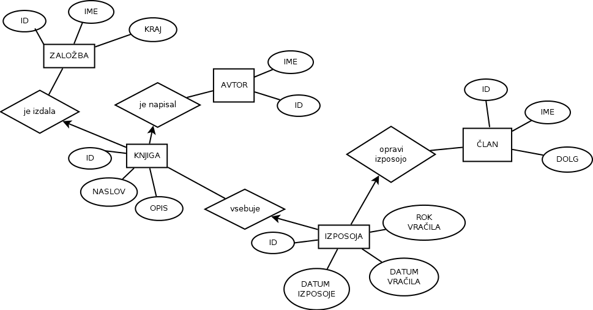

# Baza knjižnica

Avtorja:
* Katja Bela
* Zala Kitel

Seminarska naloga pri predmetu *Podatkovne baze 1*

## Opis

Baza bo hranila podatke o knjigah v knjižnici. Njihovem opisu, založbi, avtorju. Končni izdelek bo spletna storitev, v kateri bo uporabnik lahko:

*	Pogledal podrobne podatke o vsaki knjigi (opis, avtor, založba).
*	Pogledal podatke o vsakem članu (ime, knjige, dolg).
*	Dodajal in posodabljal podatke o knjigah in članih.
*	Dodajal in posodabljal podatke o izposoji in vračilu knjige.
*	Pogledal niz in vrnil podatek o naslovu knjig s tem nizom.
*	Pogledal niz in vrnil podatek o članih, katerih ime vsebuje ta niz.

## ER diagram

